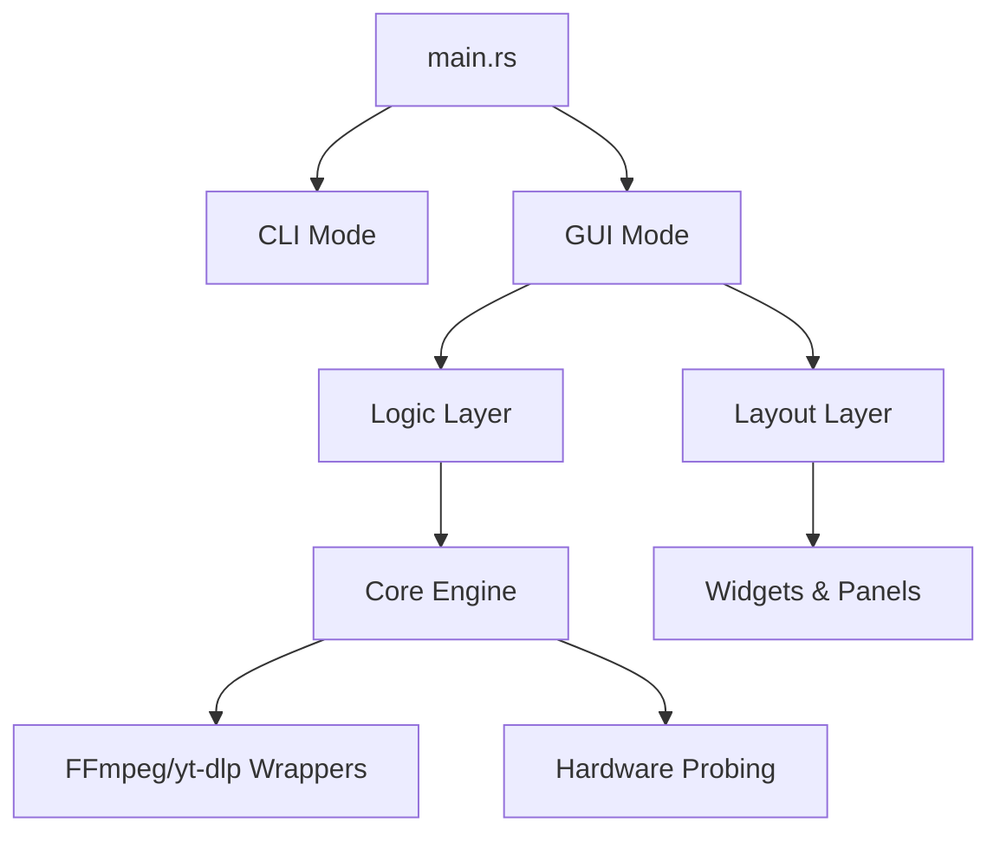

# video2mp3 🎵

<p align="center">
  
</p>

> **A blazingly fast, professional media suite for high-performance transcoding and YouTube downloading.**

**video2mp3** is an industry-grade media processing suite designed for effortless downloading and high-speed re-encoding. By bridging the raw efficiency of **FFmpeg** and **yt-dlp** with a sleek, native **egui** interface, it provides a powerful yet intuitive workspace for both single-file tasks and massive batch conversions—all boosted by full hardware acceleration.


---

## 🏛️ Project Philosophy

The project is built on the pillars of **native performance**, **professional architecture**, and **simplicity**. Recently refactored into a highly modular system, **video2mp3** serves as a template for how to build robust, thread-safe media applications in Rust using modern design patterns.

---

## ✨ Key Features

### 🌍 YouTube & Playlists
- **Smart Staged Workflow**: Analyze YouTube URLs in the background while managing your queue.
- **Full Playlist Support**: Automatically detect and expand entire playlists for batch processing.
- **Progress Tracking**: Real-time feedback for both download and post-processing phases.

### 🚀 Hardware Acceleration (Pro Grade)
- **Real-time Probing**: Dynamically detects available GPU encoders (NVENC, QSV, AMF, VAAPI, VideoToolbox).
- **Dynamic Optimization**: Automatically configures encoder flags for the best balance between speed and quality.
- **Visual Status**: Integrated UI tags show exactly which hardware features are currently usable on your system.

### 🎥 Professional Media Workspace
- **Deep Media Probing**: Detailed inspection of containers and codecs (MKV, MP4, AVI, etc.) using `ffprobe`.
- **Intelligent Track Selection**: Scans all audio streams; automatically pre-selects primary language tracks (SPA/ES).
- **Custom Design System**: A premium, high-contrast visual theme with sub-pixel text rendering and smooth transitions.

---

## 🏗️ Architectural Overview (v1.0.6+)

The project has been recently refactored into a professional modular structure:



- **`src/core/`**: Pure business logic, hardware detection, and media wrappers.
- **`src/gui/logic/`**: Thread-safe message handling and application flow control.
- **`src/gui/layout/`**: Declarative UI components and custom design system.
- **`src/config/`**: External YAML profiles for FFmpeg, yt-dlp, and FFprobe commands.
- **`src/cli/`**: Headless batch processing engine.

---

## ⚙️ Advanced Configuration (YAML)

**video2mp3** externalizes its conversion and download logic into YAML configuration files. This allows advanced users to modify FFmpeg parameters, add custom filters, or change tool paths without recompiling the application.

### 📄 Configuration Files
- **`src/config/ffmpeg.yaml`**: Defines profiles for audio extraction, remuxing, and hardware-accelerated transcoding (H.264/H.265).
- **`src/config/ytdlp.yaml`**: Manages yt-dlp arguments for metadata extraction and various download modes.
- **`src/config/ffprobe.yaml`**: Configuration for media inspection, duration probing, and stream analysis.

### 🧩 Dynamic Placeholders
The configuration uses a template system with several placeholders that are resolved at runtime:
- `{input}` / `{output}`: Source and destination file paths.
- `{audio_stream}`: The index of the user-selected audio track.
- `{hw_codec}`: Automatically resolved based on detected hardware (e.g., `h264_nvenc`, `hevc_qsv`).
- `{tune}`: Dynamic tuning for software encoders (`film` or `grain`).
- `{output_template}`: Path template for yt-dlp downloads.

---

## 🛠️ Tech Stack

| Domain                | Technology                                                                                 |
| :-------------------- | :----------------------------------------------------------------------------------------- |
| **Language**          | **Rust** (Safety-first systems programming)                                                |
| **GUI**               | [eframe](https://docs.rs/eframe/latest/eframe/) + [egui](https://github.com/emilk/egui)    |
| **Engines**           | [FFmpeg](https://ffmpeg.org/) + [yt-dlp](https://github.com/yt-dlp/yt-dlp)                 |
| **SerDe**             | [serde](https://serde.rs/) for efficient metadata parsing                                  |
| **Threading**         | Standard library MPSC channels for UI synchronization                              |

---

## 🚀 Getting Started

### Prerequisites

- **FFmpeg (v5.0+)** available in your system's `$PATH`.
- **yt-dlp** for YouTube integration features.
- **GPU Drivers**: Ensure the latest drivers are installed for hardware acceleration.

### Build from source

1. **Clone the repository**:
   ```bash
   git clone https://github.com/danloi2/convmp3.git
   cd convmp3
   ```

2. **Run in release mode**:
   ```bash
   cargo run --release
   ```

---

## 🤝 Contributing

This project is maintained as a high-quality open-source media suite. Contributions regarding new hardware acceleration profiles or UI refinements are welcome.

**Author**: Daniel Losada - [](https://github.com/danloi2)

---

## ⚖️ License

Licensed under the **MIT License**. See [LICENSE](LICENSE) for details.
