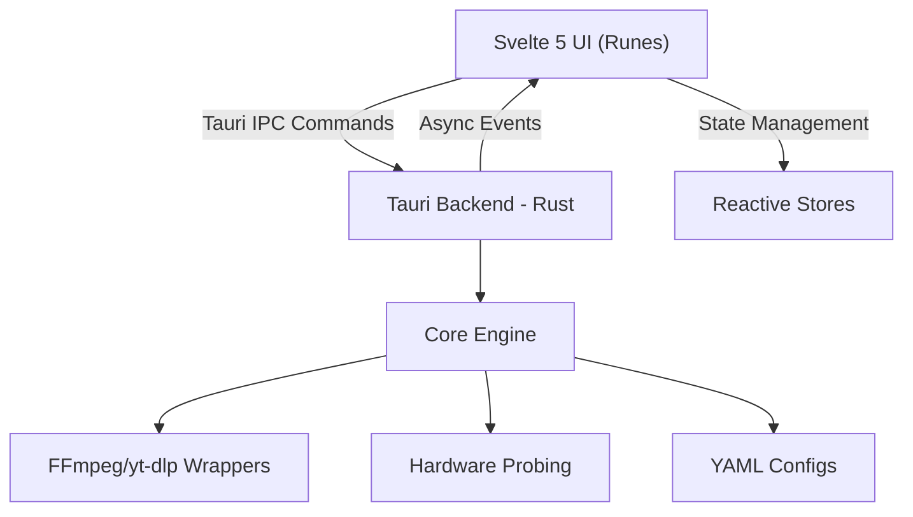

# video2mp3 🎵

<p align="center">
  
</p>

> **A blazingly fast, professional media suite for high-performance transcoding and YouTube downloading.**

**video2mp3** is an industry-grade media processing suite designed for effortless downloading and high-speed re-encoding. By bridging the raw efficiency of **FFmpeg** and **yt-dlp** with a sleek, modern **Svelte 5** and **Tauri 2.0** interface, it provides a powerful yet intuitive workspace for both single-file tasks and massive batch conversions—all boosted by full hardware acceleration and the bleeding-edge performance of **Vite 8 (Rolldown)**.


---

## 🏛️ Project Philosophy

The project is built on the pillars of **native performance**, **professional architecture**, and **beautiful UI**. Recently migrated to the **Vite 8 + Svelte 5** stack, **video2mp3** leverages the latest in web-native bundling and fine-grained reactivity to deliver an instantaneous user experience.

---

## ✨ Key Features

### 🌍 YouTube & Playlists (Advanced)
- **Codec Selection**: Force H.264 (compatibility), H.265 (efficiency), or best-quality Remux directly from the UI.
- **Smart Staged Workflow**: Analyze YouTube URLs in the background while managing your queue.
- **Full Playlist Support**: Automatically detect and expand entire playlists for batch processing.
- **Progress Tracking**: Real-time, smooth progress reporting for both download and post-processing phases.

### 🚀 Hardware Acceleration (Pro Grade)
- **Real-time Probing**: Dynamically detects available GPU encoders (NVENC, QSV, AMF, VAAPI, VideoToolbox).
- **Dynamic Optimization**: Automatically configures encoder flags for the best balance between speed and quality.
- **Visual Status**: Integrated UI tags show exactly which hardware features are currently usable on your system.

### 🎥 Professional Media Workspace
- **Safety First**: Integrated **Overwrite Protection** with confirmation dialogs for existing files.
- **Smooth Batching**: Overall progress bar uses weighted averages for a fluid, jump-free visual feedback.
- **Deep Media Probing**: Detailed inspection of containers and codecs (MKV, MP4, etc.) using `ffprobe`.
- **Intelligent Track Selection**: Scans all audio streams; automatically pre-selects primary language tracks.

---

## 🏗️ Architectural Overview (v2.0.0+)

The project has been refactored into a modern, decoupled web/native structure:



- **`src/`**: The entire frontend built with Svelte, Vanilla CSS, and Vite. Handles UI rendering and reactive state.
- **`src-tauri/src/commands/`**: Rust endpoints exposed to the frontend via the Tauri IPC bridge.
- **`src-tauri/src/core/`**: Pure business logic, hardware detection, and media wrappers.
- **`src-tauri/src/config/`**: External YAML profiles defining FFmpeg, yt-dlp, and FFprobe command architectures.

---

## ⚙️ Advanced Configuration (YAML)

**video2mp3** externalizes its conversion and download logic into YAML configuration files. This allows advanced modifications to FFmpeg parameters without touching the Rust core.

### 📄 Configuration Files (`src-tauri/src/config/`)
- **`ffmpeg.yaml`**: Defines profiles for audio extraction, remuxing, and hardware-accelerated transcoding.
- **`ytdlp.yaml`**: Manages yt-dlp arguments for metadata extraction and various download modes.
- **`ffprobe.yaml`**: Configuration for media inspection, duration probing, and stream analysis.

---

## 🛠️ Tech Stack

| Domain                | Technology                                                                                 |
| :-------------------- | :----------------------------------------------------------------------------------------- |
| **Backend**           | **Rust** + **Tauri 2.0** (System access, multi-threading, IPC)                             |
| **Frontend**          | **Svelte 5** + **Vite** + Vanilla CSS                                                      |
| **Engines**           | [FFmpeg](https://ffmpeg.org/) + [yt-dlp](https://github.com/yt-dlp/yt-dlp)                 |
| **Package Manager**   | **pnpm**                                                                                   |

---

## 🚀 Getting Started

### Prerequisites

- **FFmpeg (v5.0+)** available in your system's `$PATH`.
- **yt-dlp** for YouTube integration features.
- **Node.js (v20+)** & **pnpm**.
- **Rust Toolchain**.

### Build from source

1. **Clone the repository**:
   ```bash
   git clone https://github.com/danloi2/video2mp3.git
   cd video2mp3
   ```

2. **Install frontend dependencies**:
   ```bash
   pnpm install
   ```

3. **Run in Development Mode (Hot-Reload)**:
   ```bash
   pnpm tauri dev
   ```

4. **Build Production Installers**:
   ```bash
   pnpm tauri build
   ```

---

## 🤝 Contributing

This project is maintained as a high-quality open-source media suite. Contributions regarding new hardware acceleration profiles or UI refinements are welcome.

**Author**: Daniel Losada - [](https://github.com/danloi2)

---

## ⚖️ License

Licensed under the **MIT License**. See [LICENSE](LICENSE) for details.
